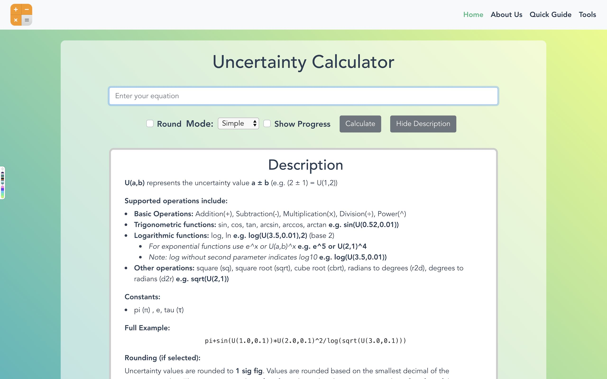
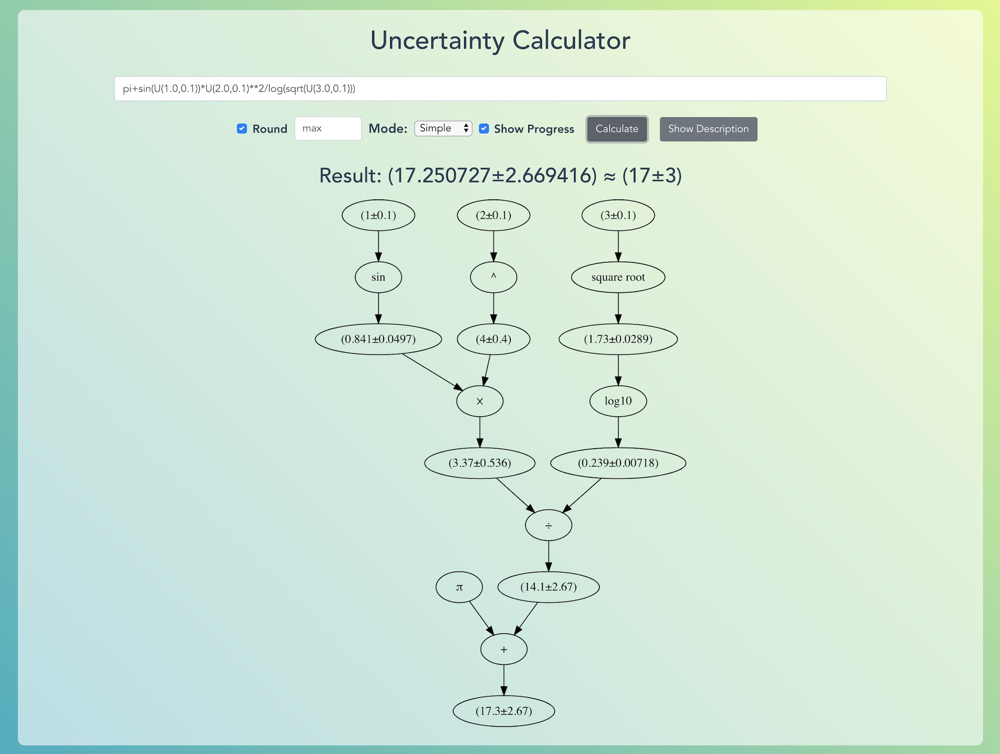

# Uncertainty Calculator

This calculator is a web app for performing calculations involving quantities with uncertainties.

[]() [](https://travis-ci.org/arnog/mathlive) 

<div style="margin-bottom: 15px">
  
</div>

**Current Progress:**

- [x] Calculates error propagation for common functions with steps of calculation
- [x] Supports accurate rounding and significant figures
- [x] Builds computational graph of calculation
- [x] Supports common constants such as π, e, and τ
- [ ] Integration with Excel data through drag and drop
- [ ] Performs calculations on entire tables
- [ ] Export results as **PDF** with Latex formatting, **csv**, and **excel** 

## Description:
U(a,b) represents the uncertainty value a ± b (e.g. (2 ± 1) = U(2,1))

**Supported operations include:**

- **Basic Operations:** Addition(+), Subtraction(-), Multiplication(⨉), Division(÷), Power(^) **e.g.  3+U(4,2)**

- **Trigonometric functions:** sin, cos, tan, arcsin, arccos, arctan **e.g. sin(U(0.52,0.01))**

- **Logarithmic functions:** log, ln **e.g. log(U(3.5,0.01),2) (base 2)**
	- _For exponential functions use e^x or U(a,b)^x  **e.g. e^5 or U(2,1)^4**_
	- _Note: log without second parameter indicates log10  **e.g. log(U(3.5,0.01))**_
	
- **Other operations:** square (sq), square root (sqrt), cube root (cbrt), radians to degrees (r2d), degrees to radians (d2r) **e.g. sqrt(U(2,1))**

  

**Constants:**

- pi (π) , e, tau (τ)

**Full Example:**
```
pi+sin(U(1.0,0.1))*U(2.0,0.1)^2/log(sqrt(U(3.0,0.1))) 
```

**Rounding (if selected):**
Uncertainty values are rounded to **1 sig fig**. Values are rounded based on the smallest decimal of the uncertainty value. The maximum number of sig figs is limited to the maximum number of sig figs of the input value.

- *Note: Numbers with only zeros after the decimal point will be rounded to 1 decimal* **e.g. 1.0000 ⇒ 1.0**

**Examples:**

- U(1.0,0.01) rounded to 3 sig figs = U(1,0)
- U(555,55) rounded to 3 sig figs = U(555,60)
- U(555,55) rounded to 2 sig figs = U(560,60)

**Computational Graphs**

Computational graphs provide a way for visualizing the process of calculating uncertainties while combining operations with the same operator.

You may be interested in this if:

- You've just started learning about calculating uncertainty values and would like to visualize the intermediate steps of the calculation
- You need to know the intermediate steps of a calculation
- You would like to visualize the order of operators in a calculation (Computer Science)
- You want to take a look at something cool 😎

- *Note: No computational graphs (show progress) will be generated for calculations with only real number values (no constants and uncertainty values).* 

<div style="margin-bottom: 15px">
  
</div>


Feel free to report any bugs and submit any feature requests through github issues or by [emailing me](mailto:thomaslin910608@gmail.com).